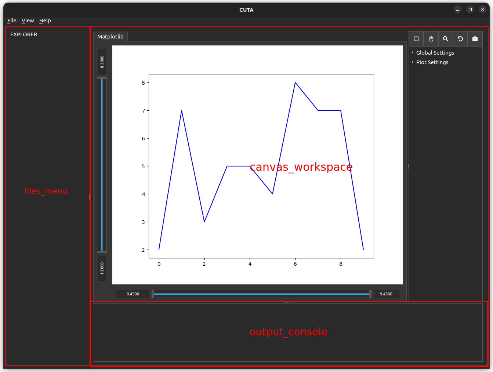

## Development

### Tutorial
---

In the following links you can see the process of adding a button that interacts with the whole application.

1. [Objective and initial idea](./Tutorial_1_Objetive_Idea.md)
2. [Setup git](./Tutorial_2_Setup.md)
3. [Create a button](./Tutorial_3_Create_a_button.md)
3. [Create a class for the button](./Tutorial_4_Create_a_class.md)

### Structure
---
Cuta has the following structure:

Which you can see when you start the application.

