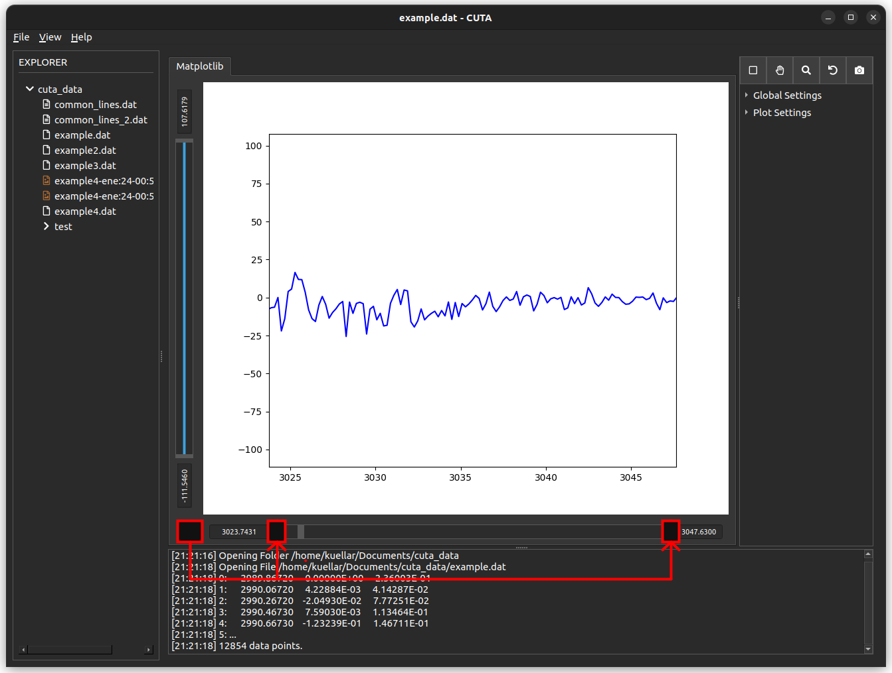

## Objective and initial idea

### Problem
---

When you zoom in too much, you can no longer move the slider.

### Initial idea
---

Add a button that resets the slider but maintains the current zoom.

### Next step
---

- [Setup git](./Tutorial_2_Setup.md)