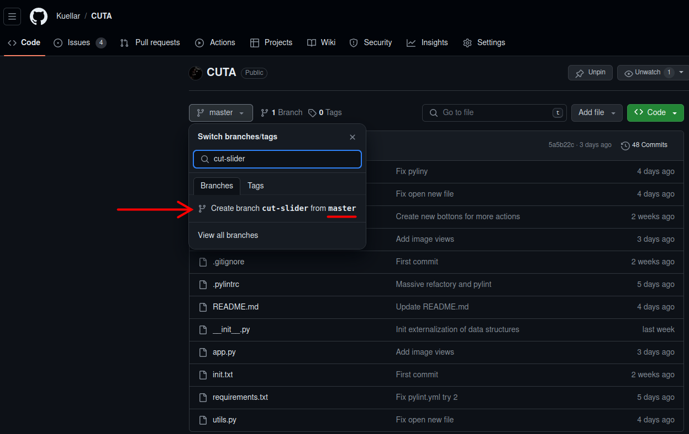
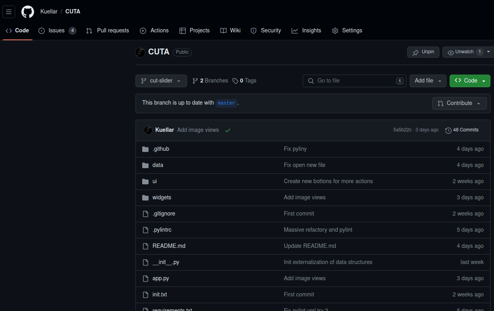
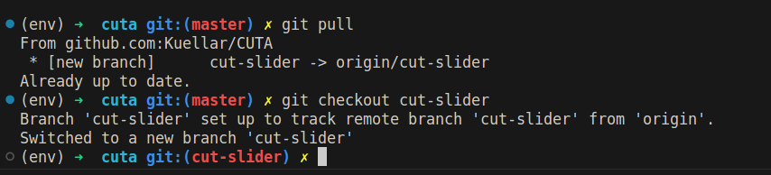

## Setup git

Before starting to program, it is necessary to create a branch to isolate all the changes made in the program. Once these changes have been verified, we proceed to merge them.

1. Create a new branch called ＜branch＞




2. Update repo in your visual studio

```
git pull
```

3. Change branch from main to ＜branch＞
```
git checkout ＜branch＞
```

result:


Now you can make changes in the code without making a mess :)

### More info
* [Git Branch - Atlassian](https://www.atlassian.com/git/tutorials/using-branches)

* [About branches - Github](https://docs.github.com/en/pull-requests/collaborating-with-pull-requests/proposing-changes-to-your-work-with-pull-requests/about-branches)
* [Creating and deleting branches within your repository - Github](https://docs.github.com/en/pull-requests/collaborating-with-pull-requests/proposing-changes-to-your-work-with-pull-requests/creating-and-deleting-branches-within-your-repository)
* [Creating a pull request - Github](https://docs.github.com/en/pull-requests/collaborating-with-pull-requests/proposing-changes-to-your-work-with-pull-requests/creating-a-pull-request)

### Previous step
---

- [Objective and initial idea](./Tutorial_1_Objetive_Idea.md)


### Next step
---

- [Create a button](./Tutorial_3_Create_a_button.md)