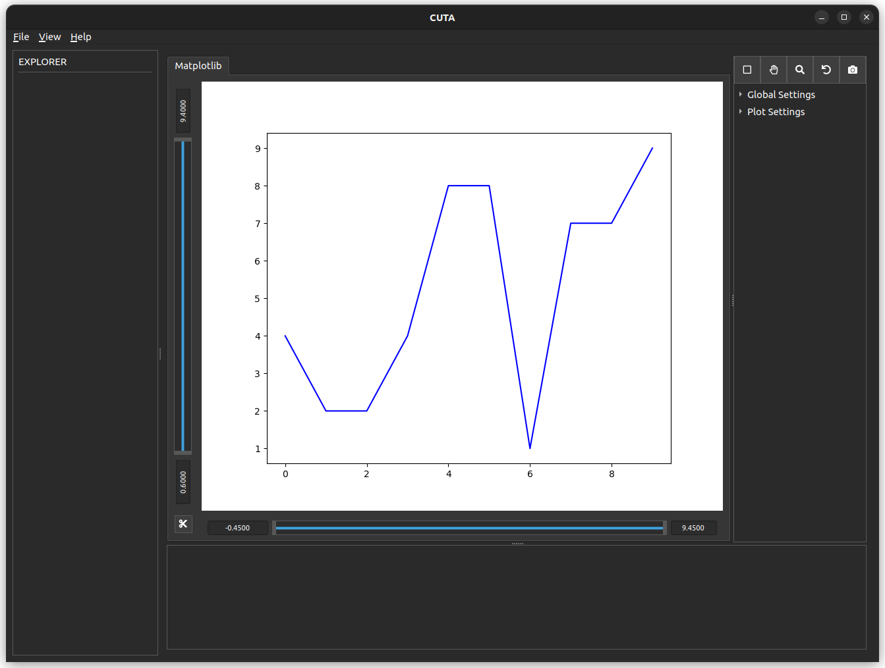
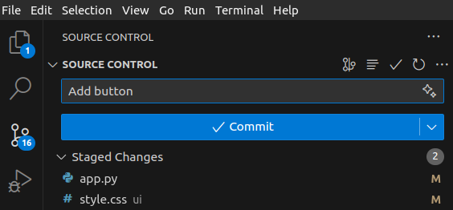
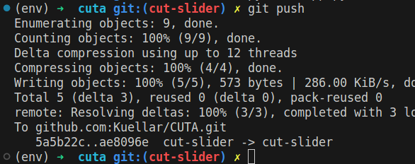

## Create a button

1. Locate the position.

line 79 fule app.py
```
78  self.canvas_plot_bottom_slider.setMaximumHeight(40)
79  canvas_plot_null = QWidget()
80  canvas_plot_grid_layout.addWidget(self.canvas_plot_left_slider, 0, 0, 1, 1)
```

2. Change "canvas_plot_null" for new button. "fa5s.cut" is the icon from https://fontawesome.com/v5/icons/cut?f=classic&s=solid

```
79  canvas_plot_cut_button = CustomButton("fa5s.cut")
```

3. Add this button to the layout
```
83  canvas_plot_grid_layout.addWidget(canvas_plot_cut_button, 1, 0, 1, 1)
```

4. Test
```
python3 app
```

5. Add style - Give a name to the button
```
canvas_plot_cut_button = CustomButton("fa5s.cut")
canvas_plot_cut_button.setObjectName("cut_button")
```

6. Edite style in /ui/style.css
```
CustomButton#cut_button {
  max-width: 25px;
  max-height: 25px;
  margin-left: 10px;
  margin-bottom: 10px;
}
```

7. Test
```
python3 app
```

8. Result


9. Save the change by committing in git.
[github tutorial](https://code.visualstudio.com/docs/sourcecontrol/overview#_commit)



10. Save the progress in github (by console)
```
git push
```


11. You can see all the changes in github :)
https://github.com/Kuellar/CUTA/commit/ae8096e67df64f64f24c2e80103a7e3456e8e14e

### Previous step
---

- [Setup git](./Tutorial_2_Setup.md)

### Next step
---

- [Create a class for the button](./Tutorial_4_Create_a_class.md)