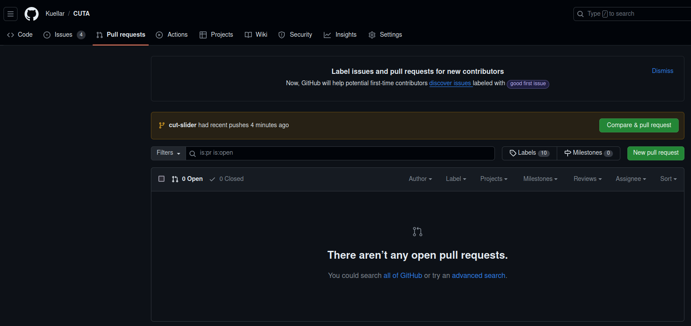
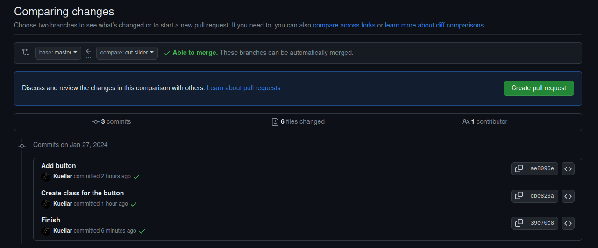

## Create a Pull request

[Github tutorial](https://docs.github.com/en/pull-requests/collaborating-with-pull-requests/proposing-changes-to-your-work-with-pull-requests/creating-a-pull-request)

1. Go to [Pull Requests](https://github.com/Kuellar/CUTA/pulls)



2. Press "New pull request"

3. Press your branch



4. Press "Create pull request"

5. Add description and press "Create pull request"

6. If your are 100% sure of the changes, press "Merge pull request"

7. Return to the master branch
```
git checkout master
```

8. Pull changes
```
git pull
```

### Previous step
---

- [Make the button do things](./Tutorial_5_Settings_button.md)
